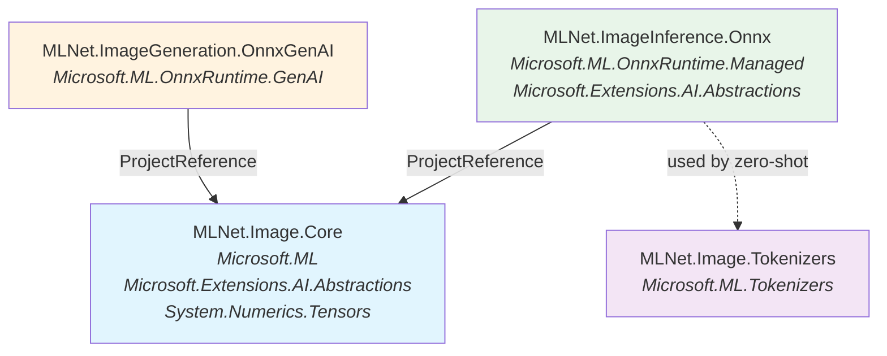
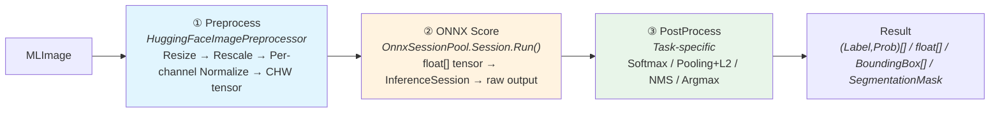
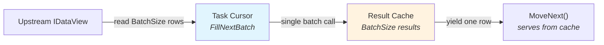
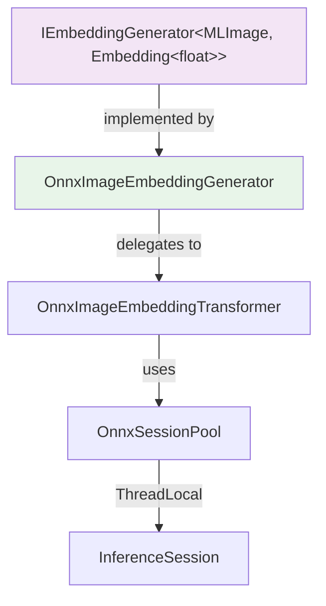
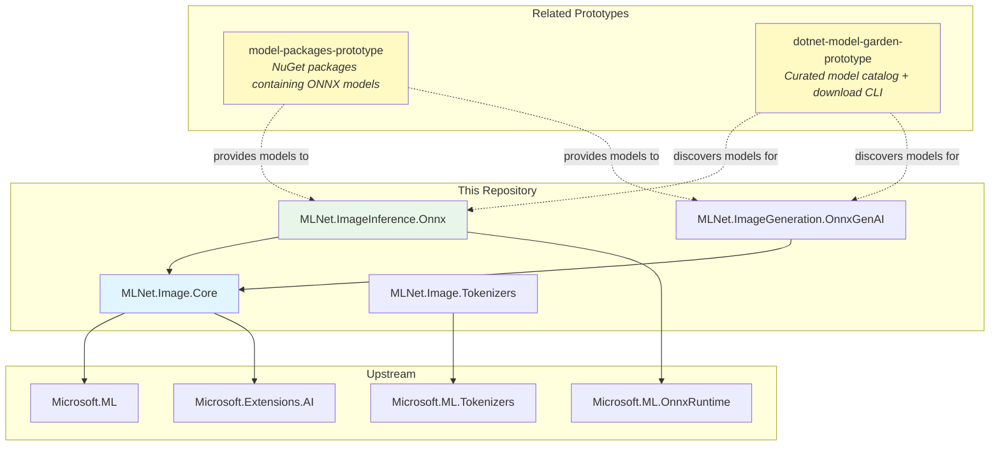

# Architecture

> Pipeline architecture, package structure, and design decisions for ML.NET Image Inference Custom Transforms.

## Package Structure

The library is split into four NuGet packages with clear dependency boundaries:

| Package | Purpose |
|---|---|
| **MLNet.Image.Core** | Image preprocessing primitives, result types (`BoundingBox`, `SegmentationMask`), `MLImage↔DataContent` conversion |
| **MLNet.Image.Tokenizers** | CLIP tokenizer wrapping `Microsoft.ML.Tokenizers.BpeTokenizer` with CLIP-specific preprocessing |
| **MLNet.ImageInference.Onnx** | ML.NET `IEstimator`/`ITransformer` implementations for classification, embeddings, detection, segmentation |
| **MLNet.ImageGeneration.OnnxGenAI** | Text-to-image generation via OnnxRuntime GenAI (planned) |

### Package Dependency Diagram



Key points:
- **Core** has no dependency on ONNX Runtime — it's pure preprocessing and types.
- **Tokenizers** is standalone — depends only on `Microsoft.ML.Tokenizers`.
- **Inference** depends on Core for preprocessing and on ONNX Runtime for model execution.
- **GenAI** depends on Core for image types and on OnnxRuntime GenAI for Stable Diffusion–style models.

---

## Three-Stage Pipeline Architecture

Every inference task follows the same three-stage pipeline pattern:



### Stage 1: Preprocess (`MLNet.Image.Core`)

`HuggingFaceImagePreprocessor.Preprocess(MLImage, PreprocessorConfig)` converts an `MLImage` into a normalized float tensor in CHW format:

1. **Extract pixels** — Read raw bytes from `MLImage.Pixels` (handles both BGRA and RGBA formats).
2. **Rescale** — Divide by 255 to map `[0, 255]` → `[0.0, 1.0]`.
3. **Per-channel normalize** — Apply `(value - mean[c]) / std[c]` per channel using values from `PreprocessorConfig`.
4. **Reorder to CHW** — Output `float[3 * H * W]` in channel-first layout expected by ONNX vision models.

`PreprocessorConfig` ships with presets for common model families:

| Preset | Mean | Std | Size | Notes |
|---|---|---|---|---|
| `ImageNet` | `[0.485, 0.456, 0.406]` | `[0.229, 0.224, 0.225]` | 224×224 | ViT, ResNet, DeiT |
| `CLIP` | `[0.481, 0.458, 0.408]` | `[0.269, 0.261, 0.276]` | 224×224 | CLIP ViT-B/32 |
| `DINOv2` | Same as ImageNet | Same as ImageNet | 224×224 | DINOv2 family |
| `YOLOv8` | — | — | 640×640 | Rescale only, no normalize |
| `SegFormer` | Same as ImageNet | Same as ImageNet | 512×512 | No center crop |

### Stage 2: ONNX Score (`MLNet.ImageInference.Onnx.Shared`)

The preprocessed tensor is wrapped in a `DenseTensor<float>` with shape `[1, 3, H, W]`, passed to `InferenceSession.Run()`, and the raw output tensor is returned. Input/output names are auto-discovered via `ModelMetadataDiscovery`.

### Stage 3: PostProcess (task-specific)

Each task applies its own post-processing to the raw ONNX output:

| Task | PostProcess | Output Type |
|---|---|---|
| Classification | Softmax → sort by probability → TopK | `(string Label, float Probability)[]` |
| Embeddings | CLS-token or mean pooling → L2 normalize | `float[]` |
| Detection | Decode boxes → NMS → filter by confidence | `BoundingBox[]` |
| Segmentation | Argmax per pixel → class ID map | `SegmentationMask` |
| Zero-Shot | Encode text + image → cosine similarity → softmax | `(string Label, float Probability)[]` |

---

## Task-Specific Pipeline Details

### Image Classification

```
MLImage → PreprocessorConfig.ImageNet → ONNX(ViT) → Softmax → (Label, Probability)[]
```

- **Options**: `OnnxImageClassificationOptions` — model path, labels, TopK, preprocessor config.
- **Estimator**: `OnnxImageClassificationEstimator` — `Fit()` creates the transformer.
- **Transformer**: `OnnxImageClassificationTransformer` — `Classify(MLImage)` runs the full pipeline.
- **PostProcess**: `TensorPrimitives.SoftMax()` on raw logits, then sort descending, optionally truncate to TopK.
- **MLContext entry**: `mlContext.Transforms.OnnxImageClassification(options)`.

### Image Embeddings

```
MLImage → PreprocessorConfig.CLIP → ONNX(CLIP ViT) → CLS/MeanPool → L2 Normalize → float[]
```

- **Options**: `OnnxImageEmbeddingOptions` — model path, pooling strategy, normalize flag.
- **Estimator**: `OnnxImageEmbeddingEstimator` — `Fit()` creates the transformer.
- **Transformer**: `OnnxImageEmbeddingTransformer` — `GenerateEmbedding(MLImage)` / `GenerateEmbeddings(IReadOnlyList<MLImage>)`.
- **PostProcess**: Extract CLS token (`output[0, 0, :]`) or mean-pool across sequence, then L2 normalize via `TensorPrimitives.Norm()` + `TensorPrimitives.Divide()`.
- **MEAI wrapper**: `OnnxImageEmbeddingGenerator` implements `IEmbeddingGenerator<MLImage, Embedding<float>>`.
- **MLContext entry**: `mlContext.Transforms.OnnxImageEmbedding(options)`.

### Object Detection (planned)

```
MLImage → PreprocessorConfig.YOLOv8 → ONNX(YOLOv8) → Decode boxes → NMS → BoundingBox[]
```

- Decodes raw output tensor `[1, num_boxes, 4+num_classes]` into `(x, y, w, h, class_scores)`.
- Applies Non-Maximum Suppression (NMS) to filter overlapping detections.
- Maps class indices to label strings.

### Image Segmentation (planned)

```
MLImage → PreprocessorConfig.SegFormer → ONNX(SegFormer) → Argmax → SegmentationMask
```

- Raw output is `[1, num_classes, H, W]` logits per pixel.
- `Argmax` across the class dimension produces per-pixel class IDs.
- Result wrapped in `SegmentationMask` with optional label lookup.

### Zero-Shot Classification (planned)

```
MLImage + string[] labels → CLIP(image encoder + text encoder) → cosine similarity → softmax → (Label, Probability)[]
```

- Uses `ClipTokenizer` from `MLNet.Image.Tokenizers` to encode candidate labels.
- Runs both image and text through CLIP encoders.
- Computes cosine similarity between image embedding and each text embedding, then softmax over similarities.

---

## Batch Inference

The library supports batch inference through two mechanisms:

### 1. Batch Convenience API

Each transformer exposes batch methods that accept multiple images at once:

- `ClassifyBatch(IReadOnlyList<MLImage>)` → `(string, float)[][]`
- `DetectBatch(IReadOnlyList<MLImage>)` → `BoundingBox[][]`
- `SegmentBatch(IReadOnlyList<MLImage>)` → `SegmentationMask[]`
- `GenerateEmbeddingBatch(IReadOnlyList<MLImage>)` → `float[][]`
- `ClassifyBatch(IReadOnlyList<MLImage>)` (zero-shot) → `(string, float)[][]`

### 2. IDataView Lookahead Batching

Cursors use the `FillNextBatch` pattern (from the text repo):

- Configurable `BatchSize` (default 32) on each task's Options class
- Cursor reads ahead `BatchSize` rows from upstream, calls the batch method, caches results
- `MoveNext()` serves from cache until exhausted, then refills
- Reduces N ONNX calls to ⌈N/BatchSize⌉



### Dynamic vs Fixed Batch

The batch strategy depends on whether the ONNX model's first input dimension is dynamic (reported as `-1` by ONNX Runtime):

| Batch Type | Strategy | Models |
|---|---|---|
| **Dynamic** (`IsBatchDynamic = true`) | TRUE tensor batching — all images stacked into one `N×C×H×W` tensor, single `session.Run()` | MobileNetV2, CLIP, DINOv2, ResNet-50, SegFormer, DeepLabV3 |
| **Fixed** (`IsBatchDynamic = false`) | Per-image loop — preprocessing is batched but ONNX inference runs once per image | SqueezeNet, YOLOv8 |

`ModelMetadataDiscovery.IsBatchDynamic` inspects the first input dimension at model load time. The transformer's batch method checks this property and selects the appropriate strategy automatically.

---

## Six-Component Pattern

Every task follows a consistent six-component architecture:

```
┌──────────────────────────────────────────────────────────┐
│  1. Options class         (task configuration)           │
│  2. PostProcessor         (task-specific output logic)   │
│  3. Estimator             (IEstimator<TTransformer>)     │
│  4. Transformer           (ITransformer + convenience)   │
│  5. MLContext extension   (mlContext.Transforms.Xxx)      │
│  6. MEAI adapter          (optional, e.g. IEmbedding...) │
└──────────────────────────────────────────────────────────┘
```

Files are organized by task under `MLNet.ImageInference.Onnx/`:

```
Classification/
  OnnxImageClassificationOptions.cs      ← 1. Options
  OnnxImageClassificationEstimator.cs    ← 3. Estimator (PostProcess is inline in Transformer)
  OnnxImageClassificationTransformer.cs  ← 2+4. Transformer with PostProcess
Embeddings/
  OnnxImageEmbeddingOptions.cs           ← 1. Options
  OnnxImageEmbeddingEstimator.cs         ← 3. Estimator
  OnnxImageEmbeddingTransformer.cs       ← 2+4. Transformer with PostProcess
MEAI/
  OnnxImageEmbeddingGenerator.cs         ← 6. MEAI adapter
Shared/
  OnnxSessionPool.cs                     ← Thread-safe session management
  ModelMetadataDiscovery.cs              ← Auto-discover ONNX input/output names/shapes
  SchemaShapeHelper.cs                   ← Reflection helper for ML.NET internals
MLContextExtensions.cs                   ← 5. All MLContext extension methods
```

---

## Design Decisions

### Why MLImage (not a custom ImageData class)?

`MLImage` (from `Microsoft.ML`) is already the standard image type in the ML.NET ecosystem. Using it directly means:

- **No conversion overhead** — images loaded via `MLImage.CreateFromFile()` or `MLImage.CreateFromStream()` flow directly into our pipeline.
- **Ecosystem compatibility** — ML.NET's built-in `LoadImages` transform produces `MLImage`, so our transforms compose naturally with existing pipelines.
- **Forward compatibility** — as ML.NET evolves its image handling, we inherit improvements automatically.

We provide `MLImage.ToDataContent()` / `DataContent.ToMLImage()` extension methods to bridge the ML.NET world (`MLImage`) with the MEAI world (`DataContent` with MIME types).

### Why per-channel preprocessing (not ExtractPixels)?

ML.NET's built-in `ExtractPixels` transform supports only a **global** offset and scale factor:

```
pixel_out = (pixel_in - offset) * scale
```

HuggingFace vision models require **per-channel** mean/std normalization:

```
pixel_out[c] = (pixel_in[c] * rescale_factor - mean[c]) / std[c]
```

Each RGB channel has its own mean and standard deviation (e.g., ImageNet: mean=`[0.485, 0.456, 0.406]`, std=`[0.229, 0.224, 0.225]`). This is not expressible with a single global offset+scale.

`HuggingFaceImagePreprocessor` fills this gap — it reads `PreprocessorConfig` (which maps directly to HuggingFace's `preprocessor_config.json`) and applies the correct per-channel normalization.

### Why Approach C (direct IEstimator/ITransformer)?

ML.NET offers three approaches for custom transforms:

| Approach | Description | Our Choice |
|---|---|---|
| **A** | `CustomMapping` delegate | ❌ Limited — can't own lifecycle, no ONNX session management |
| **B** | Compose built-in transforms | ❌ `ExtractPixels` can't do per-channel normalization |
| **C** | Implement `IEstimator<T>` / `ITransformer` directly | ✅ Full control over preprocessing, session pooling, and output schema |

Approach C gives us:
- **Full control** over the preprocessing pipeline (per-channel normalization).
- **Session lifecycle management** via `OnnxSessionPool` inside the transformer.
- **Convenience APIs** like `Classify()` and `GenerateEmbedding()` alongside the standard `Transform(IDataView)`.
- **Clean schema declaration** via `GetOutputSchema()` for pipeline composition.

### Why OnnxSessionPool with ThreadLocal?

`InferenceSession.Run()` is **not thread-safe** — concurrent calls on the same session can corrupt state or crash. Rather than using locks (which serialize inference and kill throughput), we use `ThreadLocal<InferenceSession>`:

- Each thread gets its own `InferenceSession` instance, created lazily on first access.
- No lock contention — multiple threads run inference in true parallel.
- `trackAllValues: true` ensures all sessions are properly disposed when the pool is disposed.
- The pool itself is owned by the transformer and disposed with it.

---

## MEAI Integration Pattern

The library integrates with [Microsoft.Extensions.AI](https://learn.microsoft.com/dotnet/ai/microsoft-extensions-ai) (MEAI) through adapter classes:



**Key design choices:**

1. **`MLImage` as `TInput`** — MEAI's `IEmbeddingGenerator<TInput, TEmbedding>` is generic, so we use `MLImage` directly rather than `string` or `DataContent`. This avoids unnecessary serialization/deserialization.

2. **Thin adapter** — `OnnxImageEmbeddingGenerator` is a thin wrapper that delegates to `OnnxImageEmbeddingTransformer.GenerateEmbeddings()`. It adds only MEAI metadata (`EmbeddingGeneratorMetadata`) and the async signature.

3. **Metadata discovery** — `EmbeddingGeneratorMetadata` exposes `DefaultModelDimensions` (discovered from the ONNX model's output shape) so consumers can size vector databases correctly.

4. **MLImage ↔ DataContent bridge** — For scenarios where MEAI consumers pass `DataContent` (e.g., from chat APIs), the `MLImageExtensions` helpers convert between the two representations:
   - `MLImage.ToDataContent(mediaType)` — encode to PNG/JPEG bytes with MIME type.
   - `DataContent.ToMLImage()` — decode image bytes back to `MLImage`.

### Usage Example

```csharp
// MEAI consumer — doesn't know about ONNX internals
IEmbeddingGenerator<MLImage, Embedding<float>> generator =
    new OnnxImageEmbeddingGenerator("models/clip/model.onnx");

using var image = MLImage.CreateFromFile("photo.jpg");
var embeddings = await generator.GenerateAsync([image]);
// embeddings[0].Vector is ReadOnlyMemory<float> of length 512
```

---

## Thread Safety

### OnnxSessionPool

The thread safety model centers on `OnnxSessionPool`:

```csharp
public sealed class OnnxSessionPool : IDisposable
{
    private readonly ThreadLocal<InferenceSession> _sessions;

    public InferenceSession Session => _sessions.Value!;
}
```

- **Thread-safe by isolation** — each thread gets its own `InferenceSession`.
- **Lazy creation** — sessions are only allocated when a thread first accesses `Session`.
- **Deterministic cleanup** — `Dispose()` iterates all tracked sessions and disposes them.
- **No shared mutable state** — the pool's `_modelPath` and `_sessionOptions` are immutable after construction.

### Transformer Thread Safety

- `OnnxImageClassificationTransformer` and `OnnxImageEmbeddingTransformer` are **thread-safe for inference** because they delegate to `OnnxSessionPool`.
- Options objects are immutable (`init`-only properties) and safe to share.
- `PreprocessorConfig` is a `record` with `init`-only properties — immutable and thread-safe.
- `HuggingFaceImagePreprocessor.Preprocess()` is a pure static method with no shared state.

### MEAI Adapter Thread Safety

`OnnxImageEmbeddingGenerator` inherits thread safety from the underlying transformer — multiple `GenerateAsync` calls from different threads are safe.

---

## Ecosystem Context

This library is part of a broader effort to bring HuggingFace-compatible local AI to .NET:



### model-packages-prototype

Packages ONNX models as NuGet packages with metadata (input/output shapes, preprocessing config, labels). When mature, a model package reference replaces the manual `ModelPath` + `PreprocessorConfig` setup:

```csharp
// Future: model comes from a NuGet package
var options = ModelPackage.Load<OnnxImageClassificationOptions>("google-vit-base-patch16-224");
```

### dotnet-model-garden-prototype

A curated catalog of ONNX-compatible models with a CLI for discovery and download:

```bash
dotnet model search "image classification"
dotnet model download google/vit-base-patch16-224 --format onnx
```

Together, these three repositories form a complete local-AI story: **discover** models (model garden) → **package** them (model packages) → **run** them (this library).
